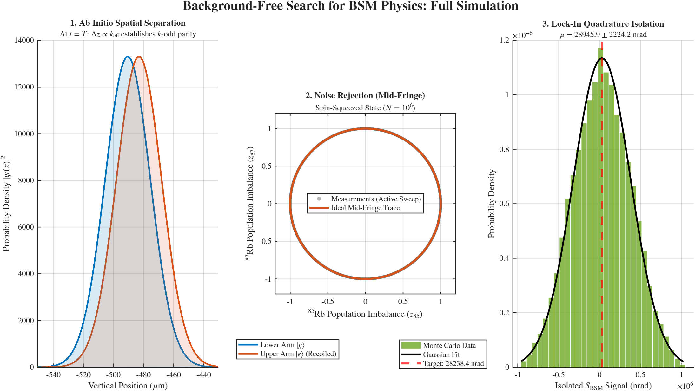

# Simulation Code: A Background-Free Search for Physics Beyond the Standard Model Using Atom Interferometry

This repository contains the advanced MATLAB simulation suite used to generate the data, projections, and figures for the paper:

**A Background-Free Search for Physics Beyond the Standard Model Using Atom Interferometry**
*Ivan Cagnani (Linnaeus University)*

## Overview

Extracting a μrad-scale Beyond Standard Model (BSM) phase shift from an atom interferometer requires overcoming gigaradian-scale gravitational backgrounds, massive vibration noise, and the fundamental kinematic degeneracy between scalar BSM couplings ($\propto \phi_g \phi_e$) and the quadratic Stark shift.

This code rigorously validates the experimental protocol proposed in the paper. To avoid the superficiality of simplified algebraic models and the prohibitive $\mathcal{O}(N^3)$ computational bottleneck of massive matrix exponentiation, this simulator is built on a high-speed, two-stage architecture: an **ab initio physics engine** followed by a **statistical noise engine**.

## Methodology

The script executes two primary computational tasks:

### Part 1: The Fast SSFM Physics Engine
Because the $k$-odd parity of the BSM and Stark operators is strictly dependent on the physical spatial separation of the atomic wavepackets, it must be evaluated quantum mechanically. 
* The engine natively solves the 1D time-dependent Schrödinger equation using the **Split-Step Fourier Method (SSFM)**.
* To prevent catastrophic momentum aliasing from the macroscopic gravitational acceleration ($g = 9.81$ m/s²), the simulation utilizes a massive spatial grid of **$N = 1,048,576$ ($2^{20}$) points**. 
* By alternating between position and momentum space via Fast Fourier Transforms (FFTs), it explicitly resolves the physical spatial separation ($\Delta z \propto k_{\text{eff}}$) and establishes the true theoretical baseline differential phases.

### Part 2: Statistical Monte Carlo Noise Engine
Using the true quantum phases established by the SSFM, the Monte Carlo engine simulates the signal extraction under severe experimental noise conditions over 25,000 complete 4-point measurement cycles (representing a 17-day integration time).
* **Mid-Fringe Spin-Squeezing:** It injects massive $2\pi$ common-mode vibration noise onto $N=10^6$ optimally spin-squeezed atoms. It utilizes active phase sweeping and a $\pi/2$ optical offset to geometrically open the covariance trace into a perfect circle, mathematically defeating *fringe-peak rectification bias* (ellipse-collapse bias).
* **Lock-In Quadrature Validation:** It injects a severe macroscopic low-frequency differential drift (~357 μrad). The simulation proves that the Double-Difference lock-in successfully algebraically annihilates the gigaradian gravity background and rejects the wandering drift to perfectly isolate the target BSM/Stark parity signal ($>10\sigma$ confidence) at the quantum limit.

## Output Visualizations

Running the script automatically generates a publication-ready **3-Panel Dashboard**:
1. **Ab Initio Spatial Separation:** Visualizes the probability density $|\psi(x)|^2$ at $t=T$, proving the fundamental $k$-odd parity of the spatial potentials.
2. **Noise Rejection (Mid-Fringe):** Plots the active phase sweep of the simultaneous dual-isotope sequence, demonstrating unbiased covariance extraction in high-noise regimes.
3. **Lock-In Quadrature Isolation:** A histogram of the 25,000 lock-in outputs, proving the successful isolation of the target nanoradian signal from the annihilated gravitational background.

## Code Files

This repository contains two versions of the simulation suite:

**1. `BSM_Search_Simulator_Ivan_Cagnani_2026.m` (Standard Version)**
* **The primary, fast-running script.**
* Executes a single 25,000-cycle Monte Carlo run using MATLAB's default pseudorandom number generator.
* Ideal for quick verification and generating the 3-panel presentation dashboard. Highly optimized, it completes the massive quantum simulation and statistical cycles in under two minutes on standard hardware.

**2. `BSM_Search_Simulator_Ivan_Cagnani_2026_with_Statistical_Validation.m` (True-Seed Validation Version)**
* **The rigorous statistical proof script.**
* Wraps the Monte Carlo engine in a 36-run master loop, explicitly initializing MATLAB's Mersenne Twister with cryptographically secure, true random integers derived from atmospheric noise (via random.org).
* Mathematically proves the isolated signal (~12.7σ confidence) is structurally sound and completely free from algorithmic PRNG artifacting using native Anderson-Darling and Lilliefors normality tests.
* *Note:* Because it executes 900,000 total statistical cycles (36 runs × 25,000 cycles), expect a longer execution time (~5 to 10 minutes depending on the processor).

## How to Run

1. Open either `.m` file in MATLAB.
2. Click the **Run** button.
3. The SSFM physics engine will compute the true phases (expect 30 to 120 seconds).
4. **If running the Standard version:** The Monte Carlo engine will execute the 25,000 cycles (~5 to 30 seconds).
5. **If running the Validation version:** The script will iterate through the 36 true-seed runs (~5 to 10 minutes) and output the Anderson-Darling and Lilliefors normality results directly to the command window.
6. The final sensitivity calculations will output, and the 3-panel dashboard will render.

### Dependencies

This code relies on native MATLAB FFT optimizations and requires a full desktop version of MATLAB (R2016b or newer). **It is not compatible with GNU Octave.**

It requires the following toolbox:
* **Statistics and Machine Learning Toolbox™**
  * Used for the `fitdist` and `pdf` functions to render the Gaussian fit on the final dashboard.
  * Used for the `adtest` (Anderson-Darling) and `lillietest` (Lilliefors) functions in the Validation version.
